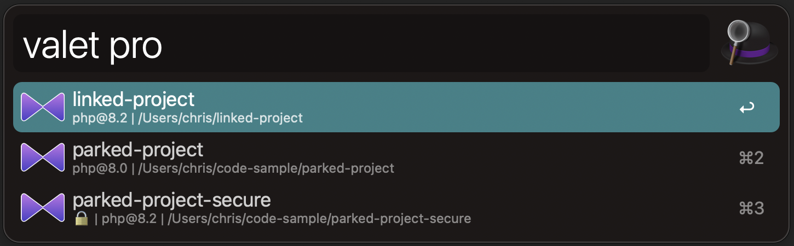

# Alfred workflow for searching Laravel Valet sites

This workflow for [Aldred 5+](https://www.alfredapp.com/) allows you to quickly search sites that are parked or linked with [Laravel Valet](https://laravel.com/docs/valet), and open them in your default browser or code editor.



## Installation

1. Ensure you have installed and configured [Laravel Valet](https://laravel.com/docs/valet).
2. Download [Site-Search-for-Valet.alfredworkflow](https://github.com/ctroms/alfred-site-search-for-valet/raw/main/Site-Search-for-Valet.alfredworkflow).
3. Double click the `Site-Search-for-Valet.alfredworkflow` file to install it.

## Configuration

Before you can start using this workflow, set your preferred code editor in the workflow configuration. You may do this by clicking "Configure Workflow" in Alfred.

You may use the file browser to select your editor, or specify a terminal command by typing it into the input.

## Useage

Type `valet` to trigger the workflow

### Search

#### List all parked and linked sites

You may enter the `*` character to list all sites.

```
valet *
```

#### Search for a site

You may search for sites by name by typing a partial name or the entire name of the site.

```
valet mysite
```

### Opening a site url in your browser

Select the site you wish to open and press return. The default action is to open the site in your systems default browser.

### Opening a site path in your code editor

To open a result in your defined code editor, press the `⌘` key on your keyboard before selecting the site.


## License

This workflow is open-sourced software licensed under the [MIT license](https://opensource.org/licenses/MIT).
